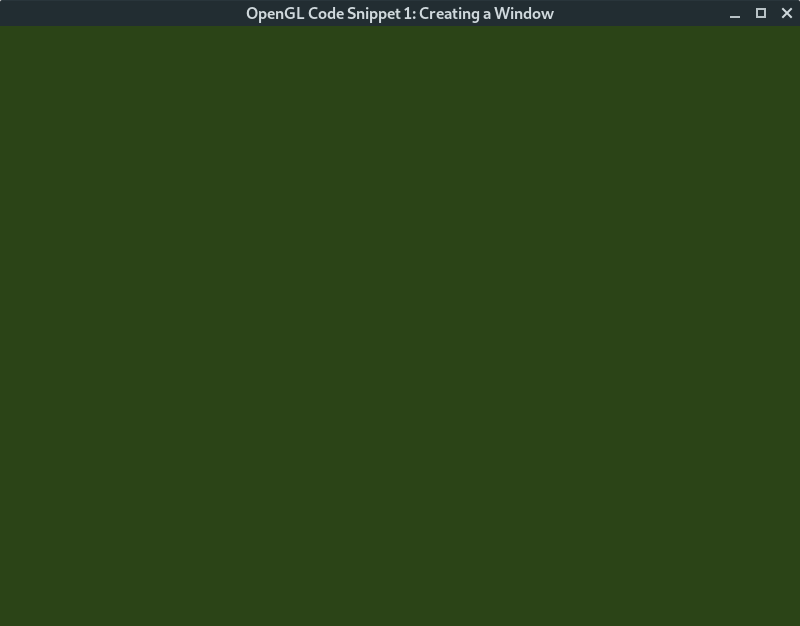
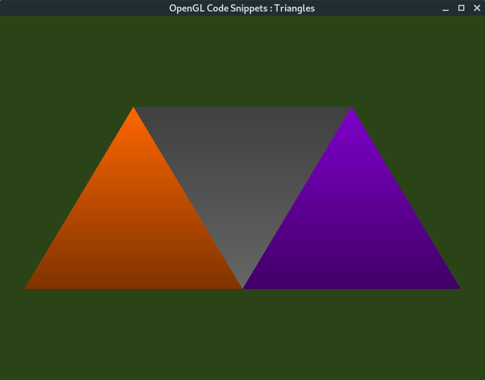

# OpenGL Snippets - Simple Code Snippets for OpenGL/C++ in Linux for Students

<p align="center">
	
	
	
</p>
***

This project contains beginner level OpenGL code snippets. The purpose is to learn OpenGL through
practical programming. 

The code snippets use OpenGL 4.0+

## Compiling snippets in Linux

To compile all the code snippets in the directory run the following

```
$ meson build
$ meson compile -C build
```

The executables are created as ```${projectdir}/build/src/*/*```
Run individual execuatable for each snippet.

## Running all snippets

The destination for compiled programs is mirrored structure in build directory.
You can just change directory to the required location and run the compiled programs.

## Testing all targets

To run all the snippets from the directory do the following too.

```
$ meson test -C build
```


## Examples

#### Tutorial 0 - OpenGL Sap Green window

```
$ ./build/src/cs0-window/cs0-window 
```




#### Tutorial 1 - Simple OpenGL Triangles

```
$ ./build/src/cs1-triangles/cs1-triangles
```




#### Tutorial 2 - Moving Triangles

```
$ ./build/src/cs1-triangles/cs
```


***


<details>
<summary>
<a class="btnfire small stroke"><em class="fas fa-chevron-circle-down"></em>&nbsp;&nbsp;Frequently Asked Questions</a>    
</summary>

<ul>
<li>

[CODE_OF_CONDUCT](CODE_OF_CONDUCT.md)
</li>


</ul>
</details>


